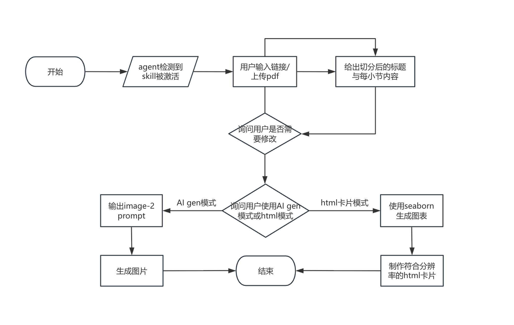

# data-viz-post

LatePost-style data visualization skill for turning news material, PDFs, screenshots, links, and datasets into chart prompts, generated images, or HTML cards.

## Workflow



## Output Modes

- **AI gen mode**: split the story into chart sections, produce image-2/gpt-image-2 prompts, then generate images after user confirmation.
- **HTML card mode**: use seaborn/matplotlib to generate precise charts, then compose a fixed 900×1200px vertical HTML card.

## Usage

Recommended: send this HTTPS link directly to your agent and ask it to download and use the skill:

```text
https://github.com/xwuw/data-viz-post
```

Local download: use the latest GitHub Release/tag package, unzip it locally, and point your agent to the extracted folder. For v0.1.0, download `https://github.com/xwuw/data-viz-post/archive/refs/tags/v0.1.0.zip`. If your agent requires the standard Codex skill layout, use `data-viz-post.md` as the skill instruction file or rename it to `SKILL.md`.

## Supported Charts

| Data type | Chart types |
| --------- | ----------- |
| 时间序列 | 折线图、面积图、末端标注线图 |
| 排名/类别比较 | 水平条形图、lollipop chart、dot plot |
| 两组对比 | dumbbell chart、slopegraph、分组柱状图 |
| 占比结构 | 100% stacked bar、treemap-like block、横向比例条 |
| 分布 | 箱线图、violin plot、ridge-like small multiples |
| 相关性 | 散点图、气泡图、带注释回归线 |
| 多指标矩阵 | heatmap、小倍数图、scorecard grid |
| 多节点流向 | Sankey diagram、alluvial flow、parallel sets |
| 类别互联关系 | chord diagram、circular network、arc diagram |
| 径向类别比较 | radial bar chart、Nightingale rose chart、polar stacked bar |
| 多序列叠加趋势 | layered area chart、streamgraph、horizon-style area |
| 演化时间线 | radial timeline、spiral timeline、ray/burst timeline |
| 生态/利益相关者关系 | ecosystem map、stakeholder map、layered influence map |
| 离散单位流转 | pictogram matrix + Sankey、icon grid + flow |

## Main Files

- `data-viz-post.md`: skill instructions and workflow.
- `assets/style-reference-1.md`: LatePost-style visual reference.
- `scripts/background_generator.py`: deterministic Python generator for reusable grain/noise backgrounds.
- `seeds/background-presets.md`: reusable noise/grain gradient seed presets.
- `references/checklist.md`: publication and prompt QA checklist.
